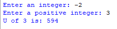

## Description 
This program prompts the user to enter an integer 'n'. It then calculates and prints the value of U(n) using a recursive formula, where U(0) = 6, and U(n+1) = 4 * U(n) + 10.
## Example 

